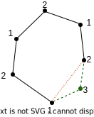
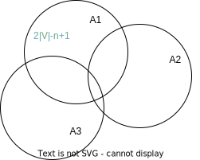

## Комбинаторика

Гиперграф $H(V,E)$ - множество вершин и множество ребер, $V$ могут быть как конечным, так и бесконечным множеством. $E \subseteq 2^V$ - ребра - это все возможные подмножества множества вершин (подмножества = сочетания). Каждое подмножество множества вершин может восприниматься как ребро.
$$
\mid V\mid = n, \mid E\mid \le 2^n
$$

$H$ - $n$-однородный гиперграф, если $\forall A\in E$, т.е. для любого ребра, $\mid A\mid = n, n\ge 2$, т.е. каждое ребро содержит $n$ вершин и считаем, что ребер, состоящих из одной вершины не бывает

$2$-однородный гиперграф - это обычный граф.

**Хроматическое число графа**

Если $G(V,E)$ - обычный граф, то $\chi(G)$ - его хроматическое число. Это минимальное количество цветов, в которые можно так покрасить все вершины, т.е. разбить множество $V$ на кусочки, чтобы концы каждого ребра имели разные цвета, т.е. принадлежали разным кусочкам.

$$
\chi(G) = \min \Big\{ \chi: V = V_1 \bigsqcup \ldots \bigsqcup V_\chi, \forall\ i, \forall\ x,y\in V_i,\ (x,y) \notin E \Big\}
$$

$V$ можно представить в виде дизъюнктивного объединения $\chi$ частей, и для любой части (любого цвета) пара $x,y$ из этой части не образует ребро. 

> $\bigsqcup$ - дизъюнктивное объединение. $A \bigsqcup B$ - это новое множество, которое состоит из всех элементов множеств $A$ и $B$ без идентификации повторяющихся элементов, т.е. если $\mid A\mid = a$ и $\mid B\mid = b$, то $\mid A \bigsqcup B\mid = a+b$, даже если $A$ и $B$ пересекаются.

**Приложение**

Есть набор задач, которые поступают на обработку. Одновременно может обрабатываться любое количество задач, но среди всех задач существуют задачи, которые нельзя выполнять одновременно. Получает граф. Вершины - это задачи, а ребра - это пары задач противоречащие друг другу.

Хроматическое число такого графа - наименьшее количество шагов, за которое все задачи могут быть выполнены, т.е. сначала решаем задачи из $V1$, затем из $V_2$, и в конце из $V_\chi$.

У гиперграфа тоже есть хроматическое число $\chi(H)$. Однако если у обычного графа концы ребра должны иметь разные цвета, то у гиперграфа возможны варианты, так как у ребра много концов (вершин). Можно рассматривать вариант, когда все вершины ребра должны иметь разные цвет, но более прикладным является случай, когда в каждом ребре должно использоваться хотя бы два цвета.

И для гиперграфа $\chi(H)$ - минимальное число цветов в такой раскраске вершин, при которой все ребра на являются одно цветными, т.е. достаточно, чтобы в каждом ребре присутствовали вершины хотя бы двух разных цветов. Даже если ребро длинное (в смысле количества вершин в нем), мы не требуем, чтобы ребро было целиком одного цвета.

**Пример**

$\chi (C_n)$ - простой цикл на $n$ вершинах.

Количество цветов для его раскрашивания зависит от четности $n$ и равен $2$ для четного $n$ и $3$ - для нечетного.

> Двудольный граф - множество вершин разбирается на две части (доли) и ребра идут только между долями.

Хроматическое число двудольного графа - $2$.

**Теорема**

Граф двудолен, когда в нем нет циклов нечетной длины.

Для гиперграфа такого простого критерия нет.

**Задача Эрдеш - Хайнал**

Пусть $H=(V,E)$ - $n$-однородный гиперграф и $\mid E\mid < 2^{n-1}$, т.е. ребер не много, но про вершины ничего неизвестно. Их может быть сколь угодно много.

Тогда $\chi(H) \le 2$.

Итак знаем, что в каждом ребре и $n$ вершин и количество ребер не слишком большое.

При этих условиях разумно рассматривать случай, когда $\mid V\mid \le n\cdot 2^{n-1}$. Иначе будут лишние вершины, которые ни в каком ребре не задействованы.

Сколько всего есть раскрасок в два цвета (красный и синий) множества вершин? Ответ - $2^{\mid V\mid}$ - количество всех возможных раскрасок.

Берем ребро $A\in E$, содержащее какое-то количество вершин, т.е. $A \subset V$.

Сколько есть раскрасок, при котором это ребро подкрашено не так, как нам хотелось бы? Т.е. оно целиком синее или красное. Нам нужно чтобы все ребра были не одноцветныею

Таких раскрасок $2^{\mid V\mid - n + 1}$. $n$ - вершин в ребре зафиксировано, значит меняться могут $\mid V \mid - n$. Количество таких вариантов $2^{\mid V\mid - n}$. И так как у нас два цвета, то нужно рассмотреть и их, т.е., когда ребро $A$ - целиком красное и целиком синее, т.е. умножить на $2$. Итого получаем $2^{\mid V\mid - n + 1}$.

На рисунки изображены множества раскрасок, относящихся к ребрам $A_1, A_2, A_3, \ldots$. Каждый из кругов содержит $2^{\mid V\mid - n + 1}$ вариантов раскрасок и понятно, что для разных ребер эти круги пересекаются.

Объединение этих кругов - это множество тех раскрасок, в которых хотя бы одно ребро одноцветное, т.е. это все плохие раскраски. Нам же нужны другие.

Мощность этого объединения $< \mid E\mid \cdot 2^{\mid V\mid - n + 1}$. Неравенство строгое, так как есть раскраски из всех синих и всех красных вершин, которые принадлежат всем кругам.

Так как $\mid E\mid < 2^{n-1}$

$$
\mid E\mid \cdot 2^{\mid V\mid - n + 1} \le 2^{n-1}\cdot 2^{\mid V\mid - n + 1} = 2^{\mid V\mid},
$$

Т.е. мощность объединения неправильных раскрасок меньше чем $2^{\mid V\mid}$, а общее число всех раскрасок в точности равно $2^{\mid V\mid}$, то значит существуют раскраски, которые не входят в круги.

На вероятностном языке это можно доказать следующим образом.

Нам дан конкретный $n$-однородный гиперграф с относительно маленьким количеством ребер.

Давайте рассмотрим случайную раскраску множества вершин устроенную по следующему принципу.

Будем двигаться по множеству вершин в каком-либо порядке, брать одну вершину за другой, подбрасывать монетку и с вероятностью $1/2$ красить вершину в красный или синий цвет.

Получаем схему испытаний Бернулли, где количество испытаний $\mid V\mid$.

$\mathcal{A}_i$ - событие, при котором ребро $A_i$ является одноцветным в нашей случайной раскраске. $\mathcal{A}_i$ - это те же круги на рисунке.

$$
P(\mathcal{A}_i) = 2\cdot \Bigg( \frac{1}{2}\Bigg)^n
$$

Множитель $2$, так как у нас два цвета и надо рассматривать оба случая.

Найдем вероятность всех кругов
$$
P\Big(\bigcap_{i=1}^{\mid E\mid} \mathcal{A}_i \Big) < \sum\limits_{i=1}^{\mid E\mid} P(\mathcal{A}_i) \le 2^{n-1} \cdot 2\cdot \Bigg( \frac{1}{2}\Bigg)^n = 1
$$
Опять получили то же утверждение. Вероятность отрицания этого события (это то, что нам нужно, т.е. раскраски, которые не принадлежат кругам) - положительна, а значит гиперграф можно покрасить.

Введем понятие

$$
m(n) = \min \Big\{ m\in \mathbb{N}: существует\ H(V,E):\mid E\mid=m, \chi(H) > 2 \Big\}
$$

$m(n)$ - минимальное количество ребер в n-однородном гиперграфе, для которого никакой метод не позволит доказать, что он двудолен, т.е. его никак нельзя покрасить в два цвета.

Нижняя оценка -
$m(n)>2^{n-1}$, потому что если количество ребер $m \le 2^{n-1}$, то мы доказали, что гиперграф красится в два цвета.

Можно ли найти верхнюю оценки? Т.е. такой пример гиперграфа с достаточно малым количеством ребер, который в два цвета покрасить нельзя.

$$
m(n) \le C_{2n-1}^n
$$

Рассмотрим полный гиперграф на $2n-1$ вершинах, т.е. на множестве вершин мы берем все возможные ребра, которые из этих вершин удастся составить.

Пусть $\{1,2,3,\ldots, 2n-1\}$ - эти числа обозначают вершины гиперграфа.

В качестве ребер берем все возможные $C_{2n-1}^n$, т.е. берем все $n$-элементные подмножества и считаем их ребрами.

Если мы покрасим элементы этого множества (вершины) в два цвета, то элементов какого-либо цвета у нас будет $\ge n$.

Мы считаем, что все возможные $n$-элементные множества являются ребрами, и вот это ребро, которое мы не сумели правильно покрасить. Это ребро в своем составе и будет иметь те по крайне мере $n$ вершин, покрашенные одним цветом.

Мы знаем, что
$$
C_{2n-1}^0 + C_{2n-1}^1 + \cdots + C_{2n-1}^n + \cdots = 2^{2n-1} 
$$

$C_{2n-1}^n$ - середина последовательности - самое (или одно из двух самых) крупных слагаемых. 

Следовательно,
$C_{2n-1}^n < 2^{2n-1}$, так как в сумме есть и другие слагаемые, но одновременно $C_{2n-1}^n > \displaystyle\frac{2^{2n-1}}{2n}$, так как в сумме $2n$ слагаемых, то их среднее будет меньше самого большого числа.

Через формулу Стирлинга можно найти
$$
C_{2n-1}^n \thicksim \frac{2}{\sqrt{\pi n}}
$$

58:k18